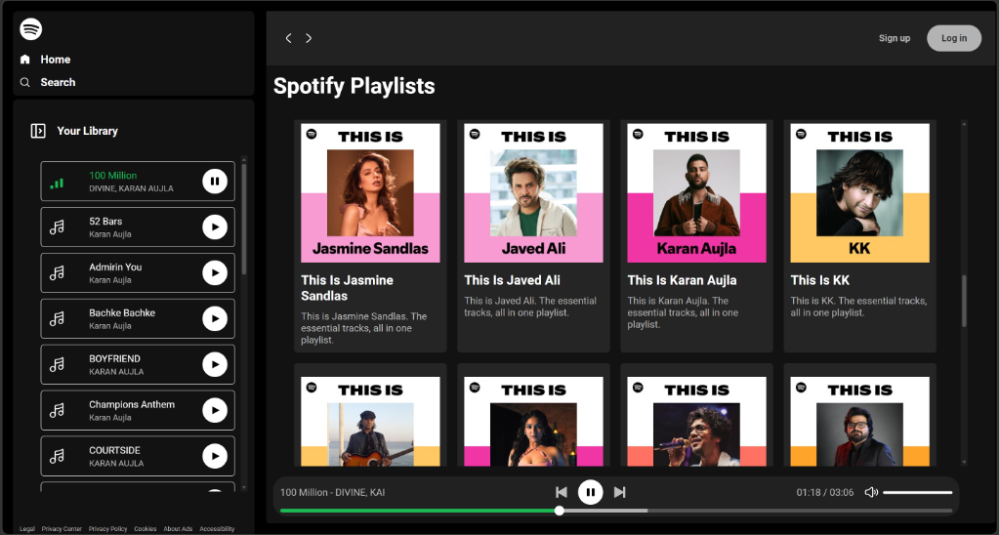
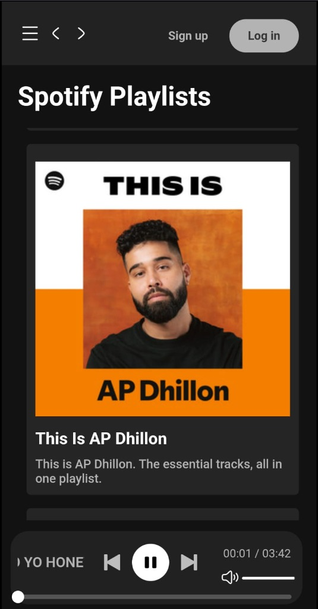

<p align="center">
  
</p>

<h1 align="center">🎵 Spotify Clone – Web Music Player</h1>

<p align="center">
  A fully responsive Spotify-inspired web music player built with <strong>vanilla HTML, CSS & JavaScript</strong>. Browse artist playlists, play/pause/skip songs, control volume, and enjoy a sleek dark-themed UI — no frameworks needed.
</p>

<p align="center">
  
  
  
  
</p>

---

## 📸 Screenshots

### 🖥️ Desktop View
<p align="center">
  
</p>

### 📱 Mobile View
<p align="center">
  
</p>

---

## ✨ Features

| Feature | Description |
|---------|-------------|
| 🎨 **Spotify-like UI** | Dark-themed interface inspired by Spotify's actual design |
| 🎵 **35+ Artist Playlists** | Pre-loaded playlists from popular artists (Atif Aslam, Arijit Singh, AP Dhillon, etc.) |
| ▶️ **Play / Pause / Skip** | Full playback controls — previous, play/pause, next |
| 🔊 **Volume Control** | Adjustable volume slider with mute/unmute toggle |
| 📊 **Seek Bar** | Interactive seek bar with hover preview (green highlight) |
| ⏱️ **Live Duration** | Real-time display of current time / total duration |
| 📱 **Fully Responsive** | Works seamlessly on desktop, tablet, and mobile devices |
| 🍔 **Hamburger Menu** | Collapsible sidebar navigation for smaller screens |
| 🎤 **Now Playing Info** | Marquee-style scrolling song info in the playbar |
| 🔄 **Auto-play Next** | Automatically plays the next song when the current one ends |
| 🎨 **Hover Animations** | Smooth hover effects on cards, buttons, and seek bar |

---

## 🗂️ Project Structure

```
Spotify-Clone/
│
├── index.html              # Main HTML entry point
├── favicon.ico             # Browser tab icon
├── README.md               # Project documentation
│
├── css/
│   ├── style.css           # Main stylesheet (layout, components, responsive)
│   └── utility.css         # Utility classes & custom scrollbar styles
│
├── js/
│   └── script.js           # Core JavaScript (audio player, UI logic, events)
│
├── img/                    # SVG icons used throughout the UI
│   ├── logo.svg            # Spotify-style logo
│   ├── home.svg            # Home icon
│   ├── search.svg          # Search icon
│   ├── playlist.svg        # Playlist/library icon
│   ├── music.svg           # Music note icon
│   ├── playsong.svg        # Play button icon
│   ├── pausesong.svg       # Pause button icon
│   ├── playing.svg         # Animated playing indicator
│   ├── nextsong.svg        # Next track icon
│   ├── previous.svg        # Previous track icon
│   ├── volume.svg          # Volume icon
│   ├── mutevolume.svg      # Muted volume icon
│   ├── hameburger.svg      # Hamburger menu icon
│   └── close.svg           # Close button icon
│
└── songs/                  # Artist folders (each contains songs + metadata)
    ├── A.R. Rahaman/
    │   ├── cover.jpg       # Album/artist cover image
    │   ├── info.json       # { "title": "...", "description": "..." }
    │   └── *.mp3           # Song file(s)
    ├── Arjit Singh/
    ├── Atif Aslam/
    ├── AP Dhillon/
    ├── Diljit Dosanjh/
    ├── Shreya Ghoshal/
    ├── ... (35 artist folders total)
    └── Vishal-Shekhar/
```

---

## 🎤 Available Artists (35 Playlists)

<details>
<summary>Click to expand full artist list</summary>

| # | Artist |
|---|--------|
| 1 | A.R. Rahman |
| 2 | Aditya Gadhvi |
| 3 | Akhil Sachdeva |
| 4 | Amit Trivedi |
| 5 | Ankit Tiwari |
| 6 | AP Dhillon |
| 7 | Arjit Singh |
| 8 | Armaan Malik |
| 9 | Ash King |
| 10 | Atif Aslam |
| 11 | Darshan Raval |
| 12 | Diljit Dosanjh |
| 13 | Dino James |
| 14 | Guru Randhawa |
| 15 | Himesh Reshammiya |
| 16 | Honey Singh |
| 17 | Jasmine Sandlas |
| 18 | Javed Ali |
| 19 | KK |
| 20 | Karan Aujla |
| 21 | Mohit Chauhan |
| 22 | Neeti Mohan |
| 23 | Papon |
| 24 | Pritam |
| 25 | Rahat Fateh Ali Khan |
| 26 | Seema Mishra |
| 27 | Shaan |
| 28 | Shafqat Amanat Ali |
| 29 | Shreya Ghoshal |
| 30 | Sonu Nigam |
| 31 | Sunidhi Chauhan |
| 32 | Talwiinder |
| 33 | Udit Narayan |
| 34 | Vishal Mishra |
| 35 | Vishal-Shekhar |

</details>

---

## 🚀 Getting Started

### Prerequisites

- A modern web browser (Chrome, Firefox, Edge, Safari)
- A local web server (required for `fetch()` API to work)

### Run Locally

1. **Clone the repository**
   ```bash
   git clone https://github.com/hiteshraj786/Spotify-Clone.git
   cd Spotify-Clone
   ```

2. **Start a local server** (choose any one method):

   ```bash
   # Using Python 3
   python -m http.server 5500

   # Using Node.js (http-server)
   npx http-server .

   # Using VS Code
   # Install "Live Server" extension → Right-click index.html → "Open with Live Server"
   ```

3. **Open in browser**
   ```
   http://localhost:5500
   ```

---

## 🛠️ Tech Stack

| Technology | Purpose |
|------------|---------|
| **HTML5** | Semantic page structure |
| **CSS3** | Styling, animations, responsive design, custom scrollbars |
| **Vanilla JavaScript** | Audio playback, DOM manipulation, event handling |
| **Google Fonts (Roboto)** | Modern, clean typography |
| **SVG Icons** | Lightweight, scalable UI icons |

---

## ⚙️ How It Works

1. **Song Loading** — On page load, `displayAlbum()` fetches the `songs/` directory, reads each artist's `info.json` for metadata, and dynamically generates playlist cards.

2. **Playlist Selection** — Clicking a card triggers `getSongs(folder)`, which fetches the artist folder, parses `.mp3` links, and populates the sidebar song list.

3. **Playback Controls** — The `Audio` API handles play/pause/seek/skip. The seekbar uses `timeupdate` events for real-time progress, and `mouseenter`/`mousemove` for hover previews.

4. **Responsive Design** — CSS media queries adapt the layout at `1250px`, `800px`, and `500px` breakpoints. A hamburger menu replaces the sidebar on smaller screens.

---

## 📂 Adding New Artists / Songs

1. Create a new folder inside `songs/` with the artist's name:
   ```
   songs/Your Artist Name/
   ```

2. Add the required files:
   - `cover.jpg` — Artist/album cover image
   - `info.json` — Metadata file:
     ```json
     {
       "title": "Your Artist Name",
       "description": "A short description of the playlist"
     }
     ```
   - `Song Name - Artist Name.mp3` — Song files (follow the `Name - Artist.mp3` naming convention)

3. Refresh the page — the new playlist card will appear automatically!

---

## 🤝 Contributing

Contributions are welcome! Here's how:

1. **Fork** this repository
2. **Create** a new branch: `git checkout -b feature/your-feature`
3. **Commit** your changes: `git commit -m "Add your feature"`
4. **Push** to the branch: `git push origin feature/your-feature`
5. **Open** a Pull Request

---

## 📄 License

This project is open source and available under the [MIT License](LICENSE).

---

## 🙏 Acknowledgements

- UI design inspired by [Spotify](https://open.spotify.com/)
- Icons created as custom SVGs
- Fonts from [Google Fonts](https://fonts.google.com/)

---

<p align="center">
  Made with ❤️ by <a href="https://github.com/hiteshraj786">Hitesh Raj</a>
</p>
